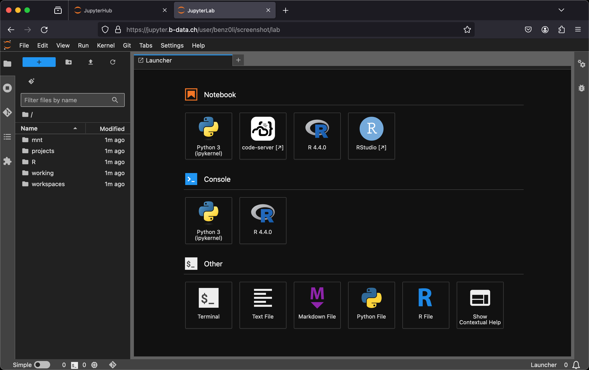

[](https://github.com/RichardLitt/standard-readme/blob/master/example-readmes/minimal-readme.md) [](https://www.repostatus.org/#active) <a href="https://liberapay.com/benz0li/donate"></a>

| See the [CUDA-based JupyterLab R docker stack](CUDA.md) for GPU accelerated docker images. |
|:-------------------------------------------------------------------------------------------|

# JupyterLab R docker stack

Multi-arch (`linux/amd64`, `linux/arm64/v8`) docker images:

* [`glcr.b-data.ch/jupyterlab/r/base`](https://gitlab.b-data.ch/jupyterlab/r/base/container_registry)
  * [`glcr.b-data.ch/jupyterlab/r/r-ver`](https://gitlab.b-data.ch/jupyterlab/r/r-ver/container_registry) (4.0.4 ≤ version < 4.2.0)
* [`glcr.b-data.ch/jupyterlab/r/tidyverse`](https://gitlab.b-data.ch/jupyterlab/r/tidyverse/container_registry)
* [`glcr.b-data.ch/jupyterlab/r/verse`](https://gitlab.b-data.ch/jupyterlab/r/verse/container_registry)
* [`glcr.b-data.ch/jupyterlab/r/geospatial`](https://gitlab.b-data.ch/jupyterlab/r/geospatial/container_registry)
* [`glcr.b-data.ch/jupyterlab/r/qgisprocess`](https://gitlab.b-data.ch/jupyterlab/r/qgisprocess/container_registry) (versions ≥ 4.3.0)

Images considered stable for R versions ≥ 4.2.0.  
:point_right: The current state may eventually be backported to versions ≥
4.0.4.

:microscope: Check out `jupyterlab/r/verse` at
https://demo.jupyter.b-data.ch.



**Build chain**

base → tidyverse → verse → geospatial → qgisprocess  
:information_source: The term verse+ means *verse or later* in the build chain.

**Features**

* **JupyterLab**: A web-based interactive development environment for Jupyter
   notebooks, code, and data. The images include
  * **code-server**: [`Code - OSS`](https://github.com/microsoft/vscode) in the
    browser.
  * **Git**: A distributed version-control system for tracking changes in source
    code.
  * **Git LFS**: A Git extension for versioning large files.
  * **GRASS GIS**: A free and open source Geographic Information System (GIS).  
    :information_source: qgisprocess image
  * **Neovim**: Vim-fork focused on extensibility and usability. (4.4.1+)
  * **Orfeo Toolbox**: An open-source project for state-of-the-art remote
    sensing.  
    :information_source: qgisprocess image (amd64 only)
  * **Pandoc**: A universal markup converter.
  * **Python**: An interpreted, object-oriented, high-level programming language
    with dynamic semantics.
  * **QGIS**: A free, open source, cross platform (lin/win/mac) geographical
    information system (GIS).  
    :information_source: qgisprocess image
  * **Quarto**: A scientific and technical publishing system built on Pandoc.  
    :information_source: verse+ images
  * **R**: A language and environment for statistical computing and graphics.
  * **radian**: An alternative console for R with multiline editing and rich
    syntax highlight.
  * **RStudio**: An integrated development environment (IDE) for R. (4.4.0+)
  * **SAGA GIS**: A Geographic Information System (GIS) software with immense
    capabilities for geodata processing and analysis.  
    :information_source: qgisprocess image
  * **TinyTeX**: A lightweight, cross-platform, portable, and easy-to-maintain
    LaTeX distribution based on TeX Live.  
    :information_source: verse+ images
  * **Zsh**: A shell designed for interactive use, although it is also a
    powerful scripting language.

:point_right: See the [Version Matrix](VERSION_MATRIX.md) for detailed
information.

The following extensions are pre-installed for **code-server**:

* [.gitignore Generator](https://github.com/piotrpalarz/vscode-gitignore-generator)
* [Black Formatter](https://open-vsx.org/extension/ms-python/black-formatter)  
  :information_source: devtools subtags
* [Docker](https://open-vsx.org/extension/ms-azuretools/vscode-docker)  
  :information_source: docker subtags
* [EditorConfig](https://open-vsx.org/extension/EditorConfig/EditorConfig)
  (4.3.0+)
* [ESLint](https://open-vsx.org/extension/dbaeumer/vscode-eslint)  
  :information_source: devtools subtags
* [Git Graph](https://open-vsx.org/extension/mhutchie/git-graph)
* [GitHub Pull Requests and Issues](https://open-vsx.org/extension/GitHub/vscode-pull-request-github)
  (4.3.1+)
* [GitLab Workflow](https://open-vsx.org/extension/GitLab/gitlab-workflow)
* [GitLens — Git supercharged](https://open-vsx.org/extension/eamodio/gitlens)  
  :information_source: Pinned to version 11.7.0 due to unsolicited AI content (4.3.1+)
* [hadolint](https://open-vsx.org/extension/exiasr/hadolint)  
  :information_source: docker subtags (4.3.1+)
* [Excel Viewer](https://open-vsx.org/extension/GrapeCity/gc-excelviewer)
* [Jupyter](https://open-vsx.org/extension/ms-toolsai/jupyter)
* [LaTeX Workshop](https://open-vsx.org/extension/James-Yu/latex-workshop)  
  :information_source: verse+ images
* [markdownlint](https://open-vsx.org/extension/DavidAnson/vscode-markdownlint)
  (4.3.2+)
* [Path Intellisense](https://open-vsx.org/extension/christian-kohler/path-intellisense)
* [Prettier - Code formatter](https://open-vsx.org/extension/esbenp/prettier-vscode)  
  :information_source: devtools subtags
* [Project Manager](https://open-vsx.org/extension/alefragnani/project-manager)
* [Python](https://open-vsx.org/extension/ms-python/python)
* [Quarto](https://open-vsx.org/extension/quarto/quarto)  
  :information_source: verse+ images
* [R](https://open-vsx.org/extension/Ikuyadeu/r)
* Resource Monitor (4.3.0+)
* [ShellCheck](https://open-vsx.org/extension/timonwong/shellcheck)  
  :information_source: devtools and docker subtags (4.3.1+)
* [YAML](https://open-vsx.org/extension/redhat/vscode-yaml)

**Subtags**

* `{R_VERSION,latest}-root` (versions ≥ 4.2.0): Container runs as `root`
* `{R_VERSION,latest}-devtools` (versions ≥ 4.2.2): Includes the requirements
  according to
  * [coder/code-server > Docs > Contributing](https://github.com/coder/code-server/blob/main/docs/CONTRIBUTING.md)
  * [REditorSupport/vscode-R > Wiki > Contributing](https://github.com/REditorSupport/vscode-R/wiki/Contributing)
* `{R_VERSION,latest}-devtools-root`: The combination of both
* `{R_VERSION,latest}-docker` (versions ≥ 4.2.2): Includes
  * `docker-ce-cli`
  * `docker-buildx-plugin`
  * `docker-compose-plugin`
  * `docker-scan-plugin` (amd64 only)
* `{R_VERSION,latest}-docker-root`: The combination of both
* `{R_VERSION,latest}-devtools-docker`: The combination of both
* `{R_VERSION,latest}-devtools-docker-root`: The combination of all three

## Table of Contents

* [Prerequisites](#prerequisites)
* [Install](#install)
* [Usage](#usage)
* [Misc](#misc)
* [Similar projects](#similar-projects)
* [Contributing](#contributing)
* [Support](#support)
* [Sponsors](#sponsors)
* [License](#license)
* [Trademarks](#trademarks)

## Prerequisites

This projects requires an installation of docker.

## Install

To install docker, follow the instructions for your platform:

* [Install Docker Engine | Docker Documentation > Supported platforms](https://docs.docker.com/engine/install/#supported-platforms)
* [Post-installation steps for Linux](https://docs.docker.com/engine/install/linux-postinstall/)

## Usage

### Build image (base)

*latest*:

```bash
cd base && docker build \
  --build-arg R_VERSION=4.4.1 \
  -t jupyterlab/r/base \
  -f latest.Dockerfile .
```

*version*:

```bash
cd base && docker build \
  -t jupyterlab/r/base:MAJOR.MINOR.PATCH \
  -f MAJOR.MINOR.PATCH.Dockerfile .
```

For `MAJOR.MINOR.PATCH` ≥ `4.2.0`.

### Create home directory

Create an empty directory using docker:

```bash
docker run --rm \
  -v "${PWD}/jupyterlab-jovyan":/dummy \
  alpine chown 1000:100 /dummy
```

It will be *bind mounted* as the JupyterLab user's home directory and
automatically populated.  
:exclamation: *Bind mounting* a subfolder of the home directory is only possible
for images with R version ≥ 4.3.2.

### Run container

self built:

```bash
docker run -it --rm \
  -p 8888:8888 \
  -u root \
  -v "${PWD}/jupyterlab-jovyan":/home/jovyan \
  -e NB_UID=$(id -u) \
  -e NB_GID=$(id -g) \
  -e CHOWN_HOME=yes \
  -e CHOWN_HOME_OPTS='-R' \
  jupyterlab/r/base[:MAJOR.MINOR.PATCH]
```

from the project's GitLab Container Registries:

```bash
docker run -it --rm \
  -p 8888:8888 \
  -u root \
  -v "${PWD}/jupyterlab-jovyan":/home/jovyan \
  -e NB_UID=$(id -u) \
  -e NB_GID=$(id -g) \
  -e CHOWN_HOME=yes \
  -e CHOWN_HOME_OPTS='-R' \
  IMAGE[:MAJOR[.MINOR[.PATCH]]]
```

`IMAGE` being one of

* [`glcr.b-data.ch/jupyterlab/r/base`](https://gitlab.b-data.ch/jupyterlab/r/base/container_registry)
* [`glcr.b-data.ch/jupyterlab/r/tidyverse`](https://gitlab.b-data.ch/jupyterlab/r/tidyverse/container_registry)
* [`glcr.b-data.ch/jupyterlab/r/verse`](https://gitlab.b-data.ch/jupyterlab/r/verse/container_registry)
* [`glcr.b-data.ch/jupyterlab/r/geospatial`](https://gitlab.b-data.ch/jupyterlab/r/geospatial/container_registry)
* [`glcr.b-data.ch/jupyterlab/r/qgisprocess`](https://gitlab.b-data.ch/jupyterlab/r/qgisprocess/container_registry)

The use of the `-v` flag in the command mounts the empty directory on the host
(`${PWD}/jupyterlab-jovyan` in the command) as `/home/jovyan` in the container.

`-e NB_UID=$(id -u) -e NB_GID=$(id -g)` instructs the startup script to switch
the user ID and the primary group ID of `${NB_USER}` to the user and group ID of
the one executing the command.

`-e CHOWN_HOME=yes -e CHOWN_HOME_OPTS='-R'` instructs the startup script to
recursively change the `${NB_USER}` home directory owner and group to the
current value of `${NB_UID}` and `${NB_GID}`.  
:information_source: This is only required for the first run.

The server logs appear in the terminal.

#### Using Podman (rootless mode, 4.3.2+)

Create an empty home directory:

```bash
mkdir "${PWD}/jupyterlab-root"
```

Use the following command to run the container as `root`:

```bash
podman run -it --rm \
  -p 8888:8888 \
  -u root \
  -v "${PWD}/jupyterlab-root":/home/root \
  -e NB_USER=root \
  -e NB_UID=0 \
  -e NB_GID=0 \
  -e NOTEBOOK_ARGS="--allow-root" \
  IMAGE[:MAJOR[.MINOR[.PATCH]]]
```

#### Using Docker Desktop

[Creating a home directory](#create-home-directory) *might* not be required.
Also

```bash
docker run -it --rm \
  -p 8888:8888 \
  -v "${PWD}/jupyterlab-jovyan":/home/jovyan \
  IMAGE[:MAJOR[.MINOR[.PATCH]]]
```

*might* be sufficient.

### Credential storage

**:exclamation: Keyring services are not available due to the difficulties of**
**setting them up in containers.**  
**Therefore, provide login credentials for the following extensions as**
**environment variables (`-e`):**

| Extension                       | Environment variable                                                                                                                                                |
|:--------------------------------|:--------------------------------------------------------------------------------------------------------------------------------------------------------------------|
| GitHub Pull Requests and Issues | `GITHUB_TOKEN`: Personal access token with scopes `repo` and `user`.[^1]                                                                                            |
| GitLab Workflow                 | `GITLAB_WORKFLOW_INSTANCE_URL`: GitLab instance URL (e.g. https://gitlab.com).<br>`GITLAB_WORKFLOW_TOKEN`: Personal access token with scopes `api` and `read_user`. |

[^1]: *Device activation* may require a one-time login from the extension's sidebar.

## Misc

### marimo

To add a JupyterLab Launcher icon for marimo:

1. Terminal: Install [marimo](https://marimo.io) and click

   ```bash
   pip install marimo click
   ```

1. Terminal: Install
   [jupyter-marimo-proxy](https://github.com/b-data/jupyter-marimo-proxy/tree/jupyterlab-docker-stack)

   ```bash
   pip install git+https://github.com/b-data/jupyter-marimo-proxy.git@jupyterlab-docker-stack
   ```

1. Restart the container

## Similar projects

* [jupyter/docker-stacks](https://github.com/jupyter/docker-stacks)
* [rocker-org/rocker-versioned2](https://github.com/rocker-org/rocker-versioned2)
* [pangeo-data/pangeo-docker-images](https://github.com/pangeo-data/pangeo-docker-images)
* [geocompx/docker](https://github.com/geocompx/docker)

**What makes this project different:**

1. Multi-arch: `linux/amd64`, `linux/arm64/v8`  
   :point_right: Since R 4.0.4 (2021-02-15)  
   :information_source: Runs on Apple M series using Docker Desktop.
1. Base image: [Debian](https://hub.docker.com/_/debian) instead of
   [Ubuntu](https://hub.docker.com/_/ubuntu)  
   :information_source: CUDA-based images use Ubuntu.
1. IDE: [code-server](https://github.com/coder/code-server) next to
   [RStudio](https://github.com/rstudio/rstudio)  
   :information_source: code-server =
   [`Code - OSS`](https://github.com/microsoft/vscode) in the browser.
1. Just Python – no [Conda](https://github.com/conda/conda) /
   [Mamba](https://github.com/mamba-org/mamba)

See [Notes](NOTES.md) for tweaks, settings, etc.

## Contributing

PRs accepted. Please submit to the
[GitLab repository](https://gitlab.com/b-data/jupyterlab/r-project/docker-stack).

This project follows the
[Contributor Covenant](https://www.contributor-covenant.org)
[Code of Conduct](CODE_OF_CONDUCT.md).

## Support

Community support: Open a new disussion
[here](https://github.com/orgs/b-data/discussions). Commercial support: Contact
b-data by [email](mailto:support@b-data.ch).

b-data tailors the JupyterLab images to your needs, e.g.

* Integration of self-signed CA certificates to enable communication with web
  services on the intranet.
* Setting up the necessary environment variables so that everything works
  behind a corporate proxy server.

Additionally, the
[JupyterHub](https://github.com/b-data/docker-deployment-jupyter) setup can be
customised to allow

* authentication with AD/LDAP
* mounting CIFS/SMB file shares

and much more.

## Sponsors

Work partially funded by

<a href="https://www.agroscope.admin.ch/agroscope/en/home.html"></a>

## License

Copyright © 2020 b-data GmbH

Distributed under the terms of the [MIT License](LICENSE), with exceptions.

## Trademarks

RStudio® is a trademark of Posit Software, PBC, all rights reserved, and may be
registered in the United States Patent and Trademark Office and in other
countries.

The use of the trademarked term RStudio® and the distribution of the RStudio
binaries through the images hosted on b-data's GitLab Container Registry
(`glcr.b-data.ch`) has been granted by explicit permission of Posit Software,
PBC. Please review
[Posit’s Trademark Guidelines](https://posit.co/about/trademark-guidelines/) and
address inquiries about further distribution to
[permissions@posit.co](mailto:permissions@posit.co).
